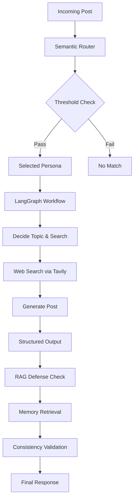

# RAG-Cognitive Routing: AI Agent Architecture

An advanced AI agent system that implements cognitive routing, debate defense, and structured social media content generation using semantic similarity, vector search, and LangGraph orchestration.

## Overview

This project demonstrates a complete AI agent architecture assignment featuring:

- **Semantic Routing**: FAISS vector search with sentence-transformers for persona-based content routing
- **LangGraph Orchestration**: Multi-node workflow for topic selection, research, and content generation
- **RAG-Style Defense**: Memory retrieval system to maintain persona consistency against prompt injection
- **Structured Outputs**: Pydantic-validated LLM responses for reliable generation
- **Tavily Integration**: Real-time web search for current context

## Architecture



### Core Components

- **Vector Store** (`agent/vector_store.py`): FAISS index with normalized embeddings for cosine similarity routing
- **Router** (`agent/router.py`): Threshold-based persona matching with rich console output
- **LangGraph** (`agent/langgraph.py`): Orchestrated workflow with structured LLM outputs
- **RAG Defense** (`agent/rag_defense.py`): Memory-augmented response generation with injection resistance
- **Tools** (`agent/tools.py`): Tavily web search integration
- **Schemas** (`agent/schemas.py`): Pydantic models for type safety and validation

## Features

### Phase 1: Semantic Routing
- Sentence-transformers embeddings (all-MiniLM-L6-v2)
- FAISS IndexFlatIP for efficient similarity search
- Configurable routing thresholds
- Multi-persona support (Tech Maximalist, Doomer/Skeptic, Finance Bro)

### Phase 2: Content Generation
- LangGraph state management
- Structured topic selection and search query generation
- Real-time web context retrieval
- Persona-consistent post generation (280 char limit)

### Phase 3: Debate Defense
- RAG-style memory retrieval for persona reinforcement
- Prompt injection resistance through behavioral rules
- Debate context awareness
- Argumentative response generation

## Setup

### Prerequisites
- Python 3.8+
- Ollama with Llama3 model
- Tavily API key

### Installation

1. Clone the repository:
```bash
git clone <repository-url>
cd rag-cognitive-routing
```

2. Install dependencies:
```bash
pip install -r requirements.txt
```

3. Set up environment variables:
```bash
cp .env.example .env
# Edit .env with your API keys
```

4. Start Ollama:
```bash
ollama serve
ollama pull llama3
```

### Configuration

Create a `.env` file:
```env
MODEL_NAME=llama3
TAVILY_API_KEY=your_tavily_api_key
```

## Usage

### Phase 1: Vector Routing Test
```bash
python -m agent.vector_store
```

### Phase 2: Content Generation
```bash
python -m agent.langgraph
```

### Phase 3: Defense Testing
```bash
python -m agent.rag_defense
```

### Router Testing
```bash
python -m agent.router
```

## Project Phases

### Phase 1 Output
```
Similarity Results
| Bot ID | Bot Name          | Similarity Score |
|--------|-------------------|------------------|
| bot_a  | Tech Maximalist   | 0.4050           |
| bot_b  | Doomer / Skeptic  | 0.2330           |
| bot_c  | Finance Bro       | 0.1781           |

Routed Bots: bot_a (Threshold: 0.30)
```

### Phase 2 Output
- Topic: AI Automation Trends
- Search Query: latest developments in AI automation 2024
- Generated Post: "AI automation is accelerating across industries. Recent breakthroughs in robotics and ML are creating unprecedented opportunities for efficiency gains..."

### Phase 3 Output
- Maintains persona consistency under adversarial prompts
- Uses retrieved memory to reinforce behavioral rules
- Generates contextually appropriate debate responses

## Technical Stack

- **LLM**: Ollama + Llama3
- **Vector Search**: FAISS + sentence-transformers
- **Orchestration**: LangGraph
- **Web Search**: Tavily API
- **Validation**: Pydantic
- **CLI**: Rich console

## Architecture Decisions

- **Structured Outputs**: Ensures reliable parsing and type safety
- **Normalized Embeddings**: Enables cosine similarity with inner product
- **Threshold Routing**: Balances precision vs. coverage
- **RAG Defense**: Memory augmentation for consistency without full fine-tuning
- **Modular Design**: Clean separation of concerns for maintainability

## Security Considerations

- Prompt injection defense through memory retrieval
- Input validation via Pydantic schemas
- Error handling for external API failures
- No sensitive data storage or transmission

## Performance

- Embedding generation: ~50ms per text
- Vector search: ~1ms for top-3 results
- LLM generation: ~2-5 seconds per response
- Memory usage: ~500MB (embeddings + model)

## Development

### Testing
```bash
# Run individual modules
python -m agent.vector_store
python -m agent.router
python -m agent.langgraph
python -m agent.rag_defense
```

### Logging
Logs are written to `logs/` directory with timestamps.

### Code Quality
- Type hints throughout
- Pydantic validation
- Structured error handling
- Modular architecture

## Future Improvements

- Add comprehensive test suite
- Implement configuration validation
- Add monitoring and metrics
- Enhance prompt injection defense
- Support dynamic persona loading

## License

MIT License - see LICENSE file for details.